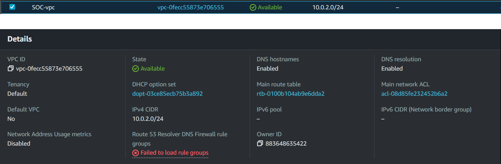

# Wuyts Lander's SOC
I have created a small SOC in my AWS environment, largely following [this video](https://www.youtube.com/watch?v=FBISHA7V15c).
This repo contains instructions and relevant files to recreate my setup.

## Table of Contents
*fill in later**

## Overview

The SOC contains the following elements:
- A Ubuntu server that serves as the production environment
- A Ubuntu server hosting Wazuh, which collects & detects events, as well as serving as a SIEM
- A Ubuntu server hosting Shuffle.io, which automates the actions taken on certain events, thus serving as a SOAR
- A Ubuntu server hosting TheHive and Cortex, serving as an incident response manager

All of these are hosted in AWS EC2 instances.
They have their own internal subnet, and are accessible with public IP addresses. 

In the current setup, the workflow is triggered when a SSH login attempt is rejected,
prompting new events in TheHive and a new message in the SOC's Discord server.

## AWS Infrastructure

This SOC was created using an AWS Learner Lab licence. 
All software runs on EC2 instances.   
No scalability or elasticity was implemented, as the scale of this project does not require it.  
In this section, the details of the AWS infrastructure are described.

### VPC

Before setting up the EC2 instances, a VPC named "SOC-vpc" is created to separate these instances internally from the larger subnet
and give more control over the internal IP addresses.

The IP subnet chosen was 10.0.2.0/24. 
There is no specific reason for this, other than VirtualBox also using this on my (previously created) local setup.  
When creating EC2 instances, the (automatically generated) 10.0.2.0/28 subnet is used.

### Security Group

To centralize inbound/outbound port rules, a single Security Group was created for all four EC2 instances.  
In a larger production environment, every instance or group of instances would likely get assigned to a separate security group.  
However, for the scale of this project one group will suffice.

The configuration of this security group and its rules can be found in [AWS\SecurityGroup](AWS/SecurityGroup/).  
The CSV files found here can be imported into AWS.

The inbound rules for Wazuh were based on the [Wazuh documentation](https://documentation.wazuh.com/current/getting-started/architecture.html#required-ports).

### EC2 instances

| Name | OS | AMI | Instance type | Key pair | VPC | Subnet | Auto-assign public IP | Security group | Storage |
| --- | --- | --- | --- | --- | --- | --- | --- | --- | --- |
| Wazuh | Ubuntu Server 22.04 LTS | ami-0574da719dca65348 (64-bit (x86)) | t2.large | pckey.pem | [SOC-vpc](#vpc) | 10.0.2.0/28 | Enable | [SOC](#security-group) | 50 GB |
| Agent | Ubuntu Server 22.04 LTS | ami-0574da719dca65348 (64-bit (x86)) | t2.micro | pckey.pem | [SOC-vpc](#vpc) | 10.0.2.0/28 | Enable | [SOC](#security-group) | 8 GB |
| Shuffle.io | Ubuntu Server 22.04 LTS | ami-0574da719dca65348 (64-bit (x86)) | t2.medium | pckey.pem | [SOC-vpc](#vpc) | 10.0.2.0/28 | Enable | [SOC](#security-group) | 100 B |
| TheHive | Ubuntu Server 22.04 LTS | ami-0574da719dca65348 (64-bit (x86)) | t2.medium | pckey.pem | [SOC-vpc](#vpc) | 10.0.2.0/28 | Enable | [SOC](#security-group) | 50 GB |

The key pair "pckey.pem" was created to access these instances over SSH.  
Public IP addresses are assigned dynamically on startup and thus change regularly.  
After the instances are created, the following (local) IP addresses were assigned:

| Name | local IPv4 address |
| -- | -- |
| Wazuh | 10.0.2.9 |
| Agent | 10.0.2.6 |
| Shuffle.io | 10.0.2.11 |
| TheHive | 10.0.2.14 |

## Setup

### Wazuh

### Wazuh agent

### Shuffle.io

### TheHive and Cortex

## Learner Lab / VM restart

## Workflow

### Attack
ssh -i "<fake SSH key>" ubuntu@ec2-<IP with - instead of .>.compute-1.amazonaws.com

## Project status

## Footnotes