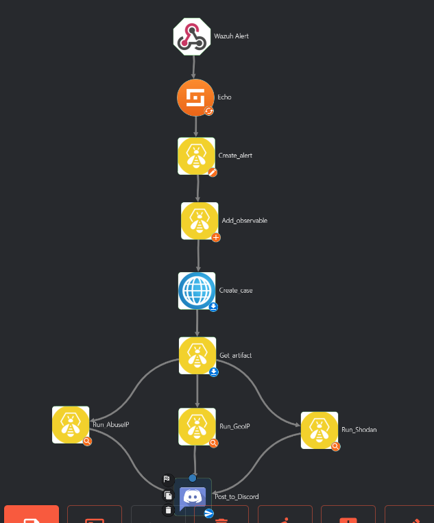

# Wuyts Lander's SOC
I have created a small SOC in my AWS environment.
This repo contains instructions and relevant files to recreate my setup.

## Table of Contents
1. [Overview](#overview)
2. [AWS Infrastructure](#aws-infrastructure)
    1. [VPC](#vpc)
    2. [Security Group](#security-group)
    3. [EC2 instances](#ec2-instances)
3. [Setup](#setup)
    1. [Wazuh](#wazuh)
    2. [Wazuh agent](#wazuh-agent)
    3. [Shuffle.io](#shuffleio)
    4. [TheHive and Cortex](#thehive-and-cortex)
4. [Workflow](#workflow)
    1. [Wazuh Alert](#wazuh-alert)
    2. [Echo](#echo)
    3. [Create alert](#create-alert)
    4. [Add observable](#add-observable)
    5. [Create case](#create-case)
    6. [Get artifact](#get-artifact)
    7. [Run analysis](#run-analysis)
    8. [Post to Discord](#post-to-discord)
    9. [Attack](#attack)
5. [Learner Lab / instance restart](#learner-lab--instance-restart)
6. [Project status](#project-status)
7. [Sources](#sources)

## Overview

The SOC contains the following elements:
- A Ubuntu server that serves as the production environment
- A Ubuntu server hosting Wazuh, which collects & detects events, as well as serving as a SIEM
- A Ubuntu server hosting Shuffle.io, which automates the actions taken on certain events, thus serving as a SOAR
- A Ubuntu server hosting TheHive and Cortex, serving as an incident response manager

All of these are hosted in AWS EC2 instances.
They have their own internal subnet, and are accessible with public IP addresses. 

In the current setup, the workflow is triggered when a SSH login attempt is rejected,
prompting new events in TheHive and a new message in the SOC's Discord server.

## AWS Infrastructure

This SOC was created using an AWS Learner Lab licence. 
All software runs on EC2 instances.   
No scalability or elasticity was implemented, as the scale of this project does not require it.  
In this section, the details of the AWS infrastructure are described.

### VPC

Before setting up the EC2 instances, a VPC named "SOC-vpc" is created to separate these instances internally from the larger subnet
and give more control over the internal IP addresses.

The IP subnet chosen was 10.0.2.0/24. 
There is no specific reason for this, other than VirtualBox also using this on my (previously created) local setup.  
When creating EC2 instances, the (automatically generated) 10.0.2.0/28 subnet is used.


### Security Group

To centralize inbound/outbound port rules, a single Security Group was created for all four EC2 instances.  
In a larger production environment, every instance or group of instances would likely get assigned to a separate security group.  
However, for the scale of this project one group will suffice.

The configuration of this security group and its rules can be found in [AWS\SecurityGroup](AWS/SecurityGroup/).  
The CSV files found here can be imported into AWS.

The inbound rules for Wazuh were based on the [Wazuh documentation](https://documentation.wazuh.com/current/getting-started/architecture.html#required-ports)[^11].


### EC2 instances

| Name | OS | AMI | Instance type | Key pair | VPC | Subnet | Auto-assign public IP | Security group | Storage |
| --- | --- | --- | --- | --- | --- | --- | --- | --- | --- |
| Wazuh | Ubuntu Server 22.04 LTS | ami-0574da719dca65348 (64-bit (x86)) | t2.large | pckey.pem | [SOC-vpc](#vpc) | 10.0.2.0/28 | Enable | [SOC](#security-group) | 50 GB |
| Agent | Ubuntu Server 22.04 LTS | ami-0574da719dca65348 (64-bit (x86)) | t2.micro | pckey.pem | [SOC-vpc](#vpc) | 10.0.2.0/28 | Enable | [SOC](#security-group) | 8 GB |
| Shuffle.io | Ubuntu Server 22.04 LTS | ami-0574da719dca65348 (64-bit (x86)) | t2.medium | pckey.pem | [SOC-vpc](#vpc) | 10.0.2.0/28 | Enable | [SOC](#security-group) | 100 B |
| TheHive | Ubuntu Server 22.04 LTS | ami-0574da719dca65348 (64-bit (x86)) | t2.medium | pckey.pem | [SOC-vpc](#vpc) | 10.0.2.0/28 | Enable | [SOC](#security-group) | 50 GB |

The key pair "pckey.pem" was created to access these instances over SSH.  
To set the right permissions on the key, the following commands were executed:[^1]
```PowerShell
$path = "~\.ssh\pckey.pem"
# Reset to remove explict permissions
icacls.exe $path /reset
# Give current user explicit read-permission
icacls.exe $path /GRANT:R "$($env:USERNAME):(R)"
# Disable inheritance and remove inherited permissions
icacls.exe $path /inheritance:r
```

Public IP addresses are assigned dynamically on startup and thus change regularly.  
After the instances are created, the following (local) IP addresses were assigned:

| Name | local IPv4 address |
| -- | -- |
| Wazuh | 10.0.2.9 |
| Agent | 10.0.2.6 |
| Shuffle.io | 10.0.2.11 |
| TheHive | 10.0.2.14 |

## Setup

All instances had their timezone (manually) set with the following command:
```shell
sudo timedatectl set-timezone Europe/Brussels
```

### Wazuh
The Wazuh instance was created following the [installation assistant](https://documentation.wazuh.com/current/installation-guide/wazuh-indexer/installation-assistant.html).[^12]

#### Indexer

Download the Wazuh installation assistant and the configuration file:

```sh
curl -sO https://packages.wazuh.com/4.3/wazuh-install.sh
curl -sO https://packages.wazuh.com/4.3/config.yml
```

The configuration file 'config.yml' was edited to resemble the file in the [Wazuh directory](/Wazuh/~/config.yml).

Then, the Wazuh cluster key, certificates and passwords are generated with the following command:

```sh
bash wazuh-install.sh --generate-config-files
```

Next, the indexer nodes are installed.
```sh
curl -sO https://packages.wazuh.com/4.3/wazuh-install.sh
bash wazuh-install.sh --wazuh-indexer node-1
```

After this, the cluster is initialized.
```sh
bash wazuh-install.sh --start-cluster
```

To get the password belonging to the **admin**-user, use the following command:
```sh
tar -axf wazuh-install-files.tar wazuh-install-files/wazuh-passwords.txt -O | grep -P "\'admin\'" -A 1
```

To confirm the installation, use the following command, replacing <ADMIN_PASSWORD> with the password received in the command above.
Replace <WAZUH_INDEXER_IP> with the IP set in the config file, 10.0.2.9 in this case.
```sh
# Check the installation
curl -k -u admin:<ADMIN_PASSWORD> https://<WAZUH_INDEXER_IP>:9200
# Check if the cluster is working correctly
curl -k -u admin:<ADMIN_PASSWORD> https://<WAZUH_INDEXER_IP>:9200/_cat/nodes?v
```

The output should look like this:
```json
{
  "name" : "node-1",
  "cluster_name" : "wazuh-cluster",
  "cluster_uuid" : "cMeWTEWxQWeIPDaf1Wx4jw",
  "version" : {
    "number" : "7.10.2",
    "build_type" : "rpm",
    "build_hash" : "e505b10357c03ae8d26d675172402f2f2144ef0f",
    "build_date" : "2022-01-14T03:38:06.881862Z",
    "build_snapshot" : false,
    "lucene_version" : "8.10.1",
    "minimum_wire_compatibility_version" : "6.8.0",
    "minimum_index_compatibility_version" : "6.0.0-beta1"
  },
  "tagline" : "The OpenSearch Project: https://opensearch.org/"
}
```

#### Server

In the same directory as before, run:
```sh
bash wazuh-install.sh --wazuh-server wazuh-1
```

That's it! Easy, innit?

#### Dashboard

The dashboard is not really required for this SOC, but it gives a nice overview when troubleshooting.
It is installed with the following code:
```sh
bash wazuh-install.sh --wazuh-dashboard dashboard
```

You can now access the Wazuh dashboard at *https://<Wazuh instance public IP>* using the username "admin" and the password requested earlier.

### Wazuh agent

The Wazuh agent is a simple, lightweight Ubuntu server with the default Wazuh agent configuration applied.  
These instructions can be found using the [Wazuh Dashboard](#dashboard), and go as follows:
```sh
curl -so wazuh-agent-4.3.10.deb https://packages.wazuh.com/4.x/apt/pool/main/w/wazuh-agent/wazuh-agent_4.3.10-1_amd64.deb && sudo WAZUH_MANAGER='10.0.2.9' WAZUH_AGENT_GROUP='SOC' dpkg -i ./wazuh-agent-4.3.10.deb
sudo systemctl daemon-reload
sudo systemctl enable wazuh-agent
sudo systemctl start wazuh-agent
```

Assuming the IP is set to 10.0.2.9 and you created a group named SOC.  
The group is not necessary for this SOC, but could be used for other configurations.  
You can just add the agent to the default group if you wish.

### Shuffle.io

Shuffle.io was installed using the [official Shuffle documentation](https://shuffler.io/docs/configuration)[^2]
and a [video tutorial](https://youtu.be/YDUKZojg0vk)[^8].

First, install Docker and Docker-compose:
```sh
sudo snap install docker
```

Next, install Shuffle:
```sh
git clone https://github.com/frikky/Shuffle
cd Shuffle
docker-compose up -d
```

Ensure that the shuffle-database folder has the right owner/group:
```sh
sudo chown 1000:1000 -R shuffle-database
```

You can now log in to the Shuffle.io dashboard via *https://<Shuffle instance public IP>:3443*, using the username "admin" and password "admin".  
The creation of the actual workflow is explained in more detail in [Workflow](#workflow).

### TheHive and Cortex

Both TheHive and Cortex were installed on the same EC2 instance. All of the following commands were done with root user privileges.

#### TheHive

TheHive was installed following the [official documentation](https://docs.thehive-project.org/thehive/installation-and-configuration/installation/step-by-step-guide/)[^3]
and a [video tutorial](https://youtu.be/VqIuP0AOCBg)[^5].

First, Java is installed:
```sh
apt-get install -y openjdk-8-jre-headless
echo JAVA_HOME="/usr/lib/jvm/java-8-openjdk-amd64" >> /etc/environment
export JAVA_HOME="/usr/lib/jvm/java-8-openjdk-amd64"
```

Then, the Apache Cassandra database is installed:
```sh
curl -fsSL https://www.apache.org/dist/cassandra/KEYS | sudo apt-key add -
echo "deb http://www.apache.org/dist/cassandra/debian 311x main" | sudo tee -a /etc/apt/sources.list.d/cassandra.sources.list
sudo apt update
sudo apt install cassandra
```

Cassandra is configured with the following commands:
```sh
cqlsh localhost 9042
```

```console
cqlsh> UPDATE system.local SET cluster_name = 'thp' where key='local';
```

```sh
nodetool flush
```

The file /etc/cassandra/cassandra.yml is edited.  
The elements that were changed can be found in [cassandra.yml](/TheHive%20-%20Cortex/etc/cassandra/cassandra.yaml) on this repo.

Then, the service is restarted.

```sh
service cassandra restart
```

Now, TheHive can be installed:
```sh
curl https://raw.githubusercontent.com/TheHive-Project/TheHive/master/PGP-PUBLIC-KEY | sudo apt-key add -
echo 'deb https://deb.thehive-project.org release main' | sudo tee -a /etc/apt/sources.list.d/thehive-project.list
sudo apt-get update
sudo apt-get install thehive4
# Ensure the following directories exist and have the right (group) owner
chown -R thehive:thehive /opt/thp/thehive/files
chown thehive:thehive -R /opt/thp/thehive/index
```

Then, the file /etc/thehive/application.conf must be edited.  
An example for this can be found in [application.conf](/TheHive%20-%20Cortex/etc/thehive/application.conf) on this repo.

Then, the service can be started:
```sh
service thehive start
```

The TheHive dashboard is now accessible at *http://<TheHive instance public IP>:9000*, using the username "admin@thehive.local" and password "secret".  
Next, create a new organization and a org-admin user in this organization.  
In this SOC, an organization named "SOC" was created with org-admin user "data@soc.com".  
Create a password for this user and generate an API key. Be sure to save these somewhere for later.


#### Cortex

Cortex was installed following the [GitHub install guide](https://github.com/TheHive-Project/CortexDocs/blob/master/installation/install-guide.md)[^4]
and a [video tutorial](https://www.youtube.com/watch?v=qz6xtINwK3I)[^6]. 

First, ElasticSearch must be installed. For this, the [Wazuh documentation](https://documentation.wazuh.com/current/deployment-options/elastic-stack/all-in-one-deployment/index.html#adding-the-elastic-stack-repository) was followed.[^10]

```sh
curl -s https://artifacts.elastic.co/GPG-KEY-elasticsearch | gpg --no-default-keyring --keyring gnupg-ring:/usr/share/keyrings/elasticsearch.gpg --import && chmod 644 /usr/share/keyrings/elasticsearch.gpg
echo "deb [signed-by=/usr/share/keyrings/elasticsearch.gpg] https://artifacts.elastic.co/packages/7.x/apt stable main" | tee /etc/apt/sources.list.d/elastic-7.x.list
apt-get update
apt-get install elasticsearch=7.17.6
curl -so /etc/elasticsearch/elasticsearch.yml https://packages.wazuh.com/4.3/tpl/elastic-basic/elasticsearch_all_in_one.yml
```

The file /etc/elasticsearch/elasticsearch.yml was modified to allow it to correctly integrate with our SOC.
The code that was added to the end can be found in the [elasticsearch.yml](/TheHive%20-%20Cortex/etc/elasticsearch/elasticsearch.yml) file on this repo.

After this, the service can be started:
```sh
service elasticsearch start
```

After this, Cortex can be installed using the [GitHub DEB instructions](https://github.com/TheHive-Project/CortexDocs/blob/master/installation/install-guide.md#deb)[^4]:
```sh
curl https://raw.githubusercontent.com/TheHive-Project/TheHive/master/PGP-PUBLIC-KEY | sudo apt-key add -
echo 'deb https://deb.thehive-project.org release main' | sudo tee -a /etc/apt/sources.list.d/thehive-project.list
sudo apt-get update
apt install cortex
```

The configuration in /etc/cortex/application.conf must be changed according to the example [application.conf](/TheHive%20-%20Cortex/etc/cortex/application.conf) file on this repo.  
Additionally, the correct secret key must be added to the Cortex application file:
```sh
sudo mkdir /etc/cortex
(cat << _EOF_
# Secret key
# ~~~~~
# The secret key is used to secure cryptographics functions.
# If you deploy your application to several instances be sure to use the same key!
play.http.secret.key="$(cat /dev/urandom | tr -dc 'a-zA-Z0-9' | fold -w 64 | head -n 1)"
_EOF_
) | sudo tee -a /etc/cortex/application.conf
```

Now, the service can be started:
```sh
service cortex start
```

The Cortex dashboard is now accessible at *http://<TheHive instance public IP>:9001*, using the username "admin" and password "admin".  
Here, click on "Update Database". If prompted, create an admin account and log in.  
Next, create a new organization and a org-admin user in this organization.  
In this SOC, an organization named "SOC" was created with org-admin user "data.cortex@soc.com".  
A user named "api" was also created to handle Shuffle.io api requests later.
Create a password for this user and generate an API key. Be sure to save these somewhere for later.


After this, Analyzers and Responders must be added to Cortex to increase functionality.  
This will be done using the [GitHub installation guide](https://github.com/TheHive-Project/CortexDocs/blob/master/installation/install-guide.md#installation).[^4]  

First, the correct packages must be installed:
```sh
cd /opt/cortex/
git clone https://github.com/TheHive-Project/Cortex-Analyzers
sudo apt-get install -y --no-install-recommends python-pip python2.7-dev python3-pip python3-dev ssdeep libfuzzy-dev libfuzzy2 libimage-exiftool-perl libmagic1 build-essential git libssl-dev
sudo pip install -U pip setuptools && sudo pip3 install -U pip setuptools && sudo pip2 install -U pip setuptools
```

Beware, this might not always work properly. If certain services and commands fail later, it might be required to go back and install some of these packages separately. Particularly the python2 and python3 packages can fail at times.

Then, All the requirements in the repo must be installed:
```sh
for I in $(find Cortex-Analyzers -name 'requirements.txt'); do sudo -H pip2 install -r $I; done && \
for I in $(find Cortex-Analyzers -name 'requirements.txt'); do sudo -H pip3 install -r $I || true; done
```

Restart the Cortex and ElasticSearch services and navigate to the Cortex Dashboard.

Go to Organization > Analyzers and add the desired analyzers.  
For this SOC, the following analyzers were [enabled](#project-status):
- AbuseIPDB
- MaxMind GeoIP
- Shodan
- Talos
- Virustotal


#### TheHive and Cortex integration

After this, Cortex needs to be integrated with TheHive.  
For this, Taylor Walton's [video tutorial](https://www.youtube.com/watch?v=lzsTSDJhAOw) was used.[^7]
The "api" user created earlier will be used.  
Copy the API key belonging to this user and add it to /etc/thehive/application.conf.  
For the configuration, see the last code block in the [application.conf](/TheHive%20-%20Cortex/etc/thehive/application.conf) file in this repo.  
After this, restart the TheHive service. Now, it should be possible to run Cortex analyses on TheHive observables.

It is also advised to upload some templates, as shown in the video tutorial at [8:28](https://youtu.be/lzsTSDJhAOw?t=508).[^7]

## Workflow

The concept of this SOC was inspired by [Taylor Walton's video on combinging Shuffle, Wazuh, TheHive and Cortex](https://www.youtube.com/watch?v=FBISHA7V15c).[^9]  
On the Shuffle.io dashboard, a new workflow named "SOC" was created.  
The full configuration of this workflow can be found in [/Shuffle/Shuffle.io.workflow.json](/Shuffle/Shuffle.io.workflow.json),  
which can be easily imported into Shuffle via the dashboard.



### Wazuh Alert

The workflow starts when Wazuh detects an appropriate event. 
This event is then sent to Shuffle through a webhook.

On the Shuffle Workflow, create a Webhook Trigger and name it "Wazuh Alert".
Copy the webhook URI and go to the Wazuh instance.  
In /var/ossec/etc/ossec.conf, add an integration code block.  
An example of this can be found in the [ossec.conf](/Wazuh/var/ossec/etc/ossec.conf) file in this repo.  
The selected rule ID, **5762**, triggers when an SSH connection is refused.

The scripts required for the webhook to function can be downloaded with the following code:
```sh
cd /var/ossec/integrations
curl -sO https://github.com/Shuffle/Shuffle/blob/main/functions/extensions/wazuh/custom-shuffle
curl -sO https://github.com/Shuffle/Shuffle/blob/main/functions/extensions/wazuh/custom-shuffle.py
chown root:wazuh custom-shuffle*
chmod 750 custom-shuffle*
```
The content of these files does not need to be changed.

Lastly, restart the Wazuh service.  
You can check if the communication is working with the logfile:
```sh
systemctl restart wazuh-manager
tail -f /var/ossec/logs/integrations.log
```

### Echo

The Wazuh Alert connects to a simple Shuffle Tool named "Echo" which repeats the alert data.  
This is used by later apps for easier reference.

### Create alert

Now, a TheHive app (1.1.3) will be used to show these alerts on the TheHive dashboard.  
First, create an authentication setting for TheHive.
- Name: Auth for thehive
- apikey: <the organization's user's API key>
- url: http://<the TheHive instance's **local** IP address>:9000/ (ex: http://10.0.2.14:9000/)
- organization: <the organizaion to which the API key user belongs> (ex: SOC)

The sourceref must be unique, so the id timestamp is used. 
The title is the (attacking) source IP address and the rule that triggered the alert.

### Add observable

We want to use the source IP address for analysis, so it must be added as an observable.  
The next TheHive app adds an alert artifact to the alert, namely the source IP of the SSH request.

### Create case

To properly analyse these observables, a case must be created in TheHive.  
Normally, you'd execute this using another TheHive app, but this gives an authorization error.  
Luckily, this is also possible with a simple HTTP curl request.
The following statement is used:
```
curl -XPOST -H 'Authorization: Bearer <API key>' http://10.0.2.14:9000/api/alert/$Create_alert.id/createCase
```

### Get artifact

After this, we want to retrieve the observable again for the Cortex analysis.  
For this, another TheHive app is used to get the case artifacts based on the ID sent with the Create Case app.

### Run analysis

Now, the workflow splits to three analyzer jobs, once again TheHive apps.  
The Cortex ID is based on your cortex configuration and can be found by going to your TheHive dashboard and selecting "About" in the upper right corner.


The Analyzer ID can be found in the Cortex dashboard on the Analyzers tab (ex: AbuseIPDB_1_0).  
Using the earlier retrieved artifact, an analysis is run for AbuseIP, GeoIP and Shodan.  
Do note that Shodan only gives a report summary if the IP is found. If not, it will not show up on the dashboard.

### Post to Discord

Lastly, to make sure our busy analyst notices the alert, a post is made to the SOC's Discord server via a Webhook.  
The message is formatted to show the source IP, triggered rule and the actual trigger in more detail.

### Attack

The trigger is started at a refused SSH login attempt.  
Because of the nature of AWS, credential-based SSH connections are blocked by default.  
Therefore, it is best to create a "fake" key by copying your ssh key and changing a few lines of code.  
Do note that this needs to be done with a bit of care;  
Too many modifications and the key will be refused as a bad key.  
Too little modifications and the key will just be accepted (I know, crazy right?).
Then, you can attempt to access the instance with the following command:

```PowerShell
ssh -i "<path to fake SSH key>" ubuntu@ec2-<agent IP with - instead of .>.compute-1.amazonaws.com
```

[Video Demo](https://youtu.be/IM6t_1suqWU).

## Learner Lab / instance restart

When the instances are stopped and restarted, the public IP address changes.  
This happens when the learner lab restarts.  
In this case, the following actions need to be taken:  

The **Shuffle.io webhook** URL needs to be replaced in the Wazuh configuration:
- Go to the *Shuffle webapp*, select the webhook and copy the URL
- Go to the *Wazuh instance* and replace the URL in the integration section of /var/ossec/etc/ossec.conf
- Restart the Wazuh manager
```sh
sudo nano /var/ossec/etc/ossec.conf
sudo systemctl restart wazuh-manager
```

The following **services** must be started on the *TheHive instance*:
- thehive
- elasticsearch
- cortex
```sh
sudo service thehive start
sudo service cortex start
sudo service elasticsearch start
```

## Project status

The VirusTotal and Talos analysises on Cortex do work, but does not return a report summary, which means it does not "tag" the event in TheHive. Because of this, VirusTotal and Talos are not used in the workflow.

## Sources
[^1]: Randhawa, J. (2018-06-29). *Set permission of file equivalent to chmod 400 on Windows*. Retrieved from gist.github.com: https://gist.github.com/jaskiratr/cfacb332bfdff2f63f535db7efb6df93

[^2]: Shuffle AS. (n.d.). *Configure Shuffle*. Retrieved from shuffler.io: https://shuffler.io/docs/configuration

[^3]: TheHive Project. (2021-06-02). *Step-by-Step guide*. Retrieved from docs.thehive-project.org: https://docs.thehive-project.org/thehive/installation-and-configuration/installation/step-by-step-guide/

[^4]: TheHive Project. (2022-07-07). *Installation Guide*. Retrieved from github.com: https://github.com/TheHive-Project/CortexDocs/blob/master/installation/install-guide.md

[^5]: Walton, T. (2021-06-25). *TheHive - Build Your Own Security Operations Center (SOC)*. Retrieved from youtube.com: https://www.youtube.com/watch?v=VqIuP0AOCBg

[^6]: Walton, T. (2021-07-27). *CORTEX - Analyze Observables (IPs, domains, etc.) at Scale! - Build Your Own Intelligence Platform!*. Retrieved from youtube.com: https://www.youtube.com/watch?v=qz6xtINwK3I

[^7]: Walton, T. (2021-07-29). *TheHive and Cortex Integration - Add Intelligence to Your SOC!*. Retrieved from youtube.com: https://www.youtube.com/watch?v=lzsTSDJhAOw

[^8]: Walton, T. (2021-11-28). *Host Your Own SOAR - Shuffle Install*. Retrieved from youtube.com: https://www.youtube.com/watch?v=YDUKZojg0vk

[^9]: Walton, T. (2021-12-13). *Shuffle + Wazuh + TheHIVE + Cortex = Automation Bliss*. Retrieved from youtube.com: https://www.youtube.com/watch?v=FBISHA7V15c

[^10]: Wazuh Inc. (n.d.). *All-in-one deployment*. Retrieved from documentation.wazuh.com: https://documentation.wazuh.com/current/deployment-options/elastic-stack/all-in-one-deployment/index.html#adding-the-elastic-stack-repository

[^11]: Wazuh Inc. (n.d.). *Architecture*. Retrieved from documentation.wazuh.com: https://documentation.wazuh.com/current/getting-started/architecture.html#required-ports

[^12]: Wazuh Inc. (n.d.). *Wazuh indexer*. Retrieved from documentation.wazuh.com: https://documentation.wazuh.com/current/installation-guide/wazuh-indexer/index.html
